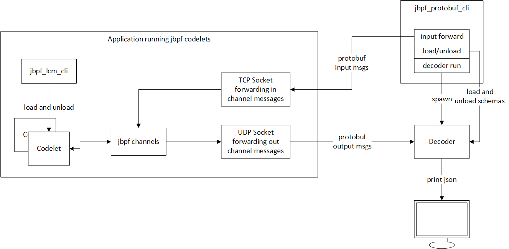

# High level Architecture

`jbpf_protobuf_cli` provides tooling to generate serialization assets for `jbpf` using protobuf.

For complete details of each subcommand, see `./jbpf_protobuf_cli {SUBCOMMAND} --help`.



## Serde

The `serde` subcommand generates assets from protobuf specs which can integrate with `jbpf`'s [serde functionality](../jbpf/docs/serde.md).

Developers must write `.proto` file(s) defining the models that are to be serialized. Additionally they must provide [generator options](https://jpa.kapsi.fi/nanopb/docs/reference.html#generator-options) as defined by nanopb to ensure generated structs can be defined in C as contiguous memory structs.


### Simple example

This example goes through generating serde assets for a simple protobuf schema.

```
// schema.proto
syntax = "proto2";

message my_struct {
  required int32 value = 1;
  required string name = 2;
}

// schema.options
my_struct.name  max_size:32
```

```sh
# To see all flags and options available, see
./jbpf_protobuf_cli serde --help

# Generate the jbpf serde assets for the above proto spec
./jbpf_protobuf_cli serde -s schema:my_struct
```

This will generate the following files:
* `schema:my_struct_serializer.c`:
  ```c
  #define PB_FIELD_32BIT 1
  #include <pb.h>
  #include <pb_decode.h>
  #include <pb_encode.h>
  #include "schema.pb.h"

  const uint32_t proto_message_size = sizeof(my_struct);

  int jbpf_io_serialize(void* input_msg_buf, size_t input_msg_buf_size, char* serialized_data_buf, size_t serialized_data_buf_size) {
    if (input_msg_buf_size != proto_message_size)
      return -1;

    pb_ostream_t ostream = pb_ostream_from_buffer((uint8_t*)serialized_data_buf, serialized_data_buf_size);
    if (!pb_encode(&ostream, my_struct_fields, input_msg_buf))
      return -1;

    return ostream.bytes_written;
  }

  int jbpf_io_deserialize(char* serialized_data_buf, size_t serialized_data_buf_size, void* output_msg_buf, size_t output_msg_buf_size) {
    if (output_msg_buf_size != proto_message_size)
      return 0;

    pb_istream_t istream = pb_istream_from_buffer((uint8_t*)serialized_data_buf, serialized_data_buf_size);
    return pb_decode(&istream, my_struct_fields, output_msg_buf);
  }
  ```
* `schema:my_struct_serializer.so` is the compiled shared object library of `schema:my_struct_serializer.c`.
* `schema.pb` is the complied protobuf spec.
* `schema.pb.c` is the generated nanopb constant definitions.
* `schema.pb.h` is the generated nanopb headers file.

When loading the codelet description you can provide the generated `{schema}:{message_name}_serializer.so` as the io_channel `serde.file_path`.

Additionally, you can provide the `{schema}.pb` to a decoder to be able to dynamically decode/encode the protobuf messages.

To see detailed usage, run `jbpf_protobuf_cli serde --help`.

## Decoder

The cli tool also provides a `decoder` subcommand which can be run locally to receive and print protobuf messages sent over a UDP channel. The examples [example_collect_control](../examples/first_example_ipc/example_collect_control.cpp) and [first_example_standalone](../examples/first_example_standalone/example_app.cpp) bind to a UDP socket on port 20788 to send output data from jbpf which matches the default UDP socket for the decoder.

This is useful for debugging output from jbpf and provide an example of how someone might dynamically decode output from jbpf by providing `.pb` schemas along with the associated stream identifier.

To see detailed usage, run `jbpf_protobuf_cli decoder --help`.

## Input Forwarder

The tool also provides the ability to dynamically send protobuf input to jbpf from an external entity. It uses a TCP socket to send input channel messages to a jbpf instance. The examples [example_collect_control](../examples/first_example_ipc/example_collect_control.cpp) and [first_example_standalone](../examples/first_example_standalone/example_app.cpp) bind to a TCP socket on port 20787 to receive input data for jbpf which matches the default TCP socket for the input forwarder.

To see detailed usage, run `jbpf_protobuf_cli input forward --help`.
